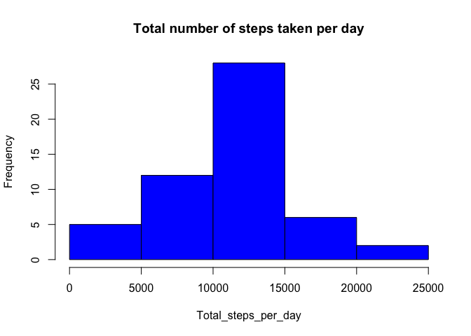
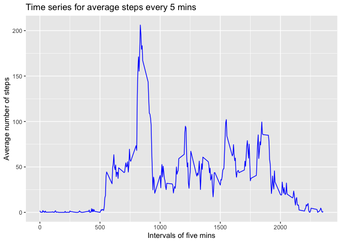
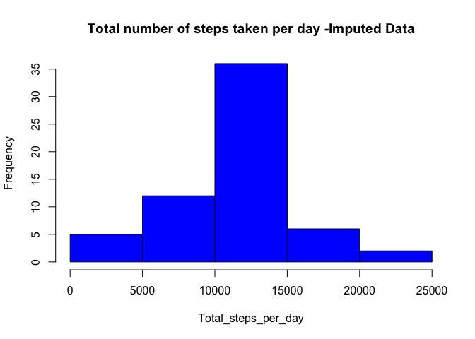
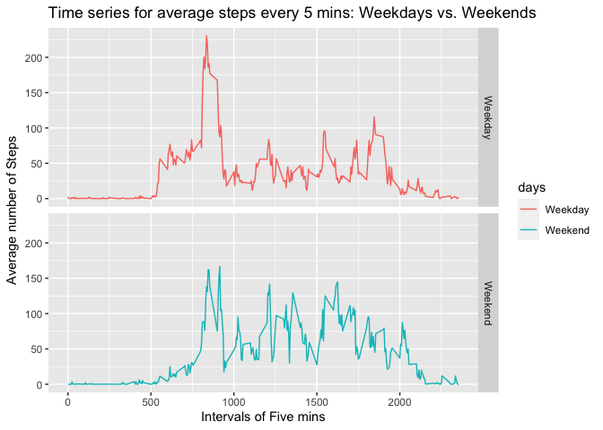

### This document is a part of Assignment for the course Reproducible Research: Peer Assessment 1.  

This code sets the global display to always include codes and loads the required libraries. 


```r
knitr::opts_chunk$set(echo = TRUE)
library(knitr)
library(ggplot2)
```

## Loading and preprocessing the data  

##### Question: Show any code that is needed to Load the data (i.e.read.csv()) Process/transform the data (if necessary) into a format suitable for your analysis.

The codes below :

1. Load the data
2. Explore the data
3. Process/transform the date to Date class 


```r
#Load
Data <- read.csv("activity.csv", header  = TRUE)
#Explore
dim(Data)
```

```
## [1] 17568     3
```

```r
head(Data)
```

```
##   steps       date interval
## 1    NA 2012-10-01        0
## 2    NA 2012-10-01        5
## 3    NA 2012-10-01       10
## 4    NA 2012-10-01       15
## 5    NA 2012-10-01       20
## 6    NA 2012-10-01       25
```

```r
str(Data)
```

```
## 'data.frame':	17568 obs. of  3 variables:
##  $ steps   : int  NA NA NA NA NA NA NA NA NA NA ...
##  $ date    : Factor w/ 61 levels "2012-10-01","2012-10-02",..: 1 1 1 1 1 1 1 1 1 1 ...
##  $ interval: int  0 5 10 15 20 25 30 35 40 45 ...
```

```r
# Transform - change second column to date format
Data$date<- as.Date(as.character(Data$date), "%Y-%m-%d")
```

## What is mean total number of steps taken per day?

For this part of the assignment the missing values in the dataset were ignored.

##### Question: Calculate the total number of steps taken per day

The total number of steps taken per day were calculated.


```r
#add the steps for each day
Steps_per_day <- aggregate(steps ~ date, Data, sum, na.rm = TRUE)
```

##### Question: Make a histogram of the total number of steps taken each day

Histogram was plotted using the base system of plotting.


```r
#make plot
hist(Steps_per_day$steps, main = "Total number of steps taken per day", xlab = "Total_steps_per_day", col = "blue")
```

<!-- -->
  
##### Question: Calculate and report the mean and median of the total number of steps taken per day.  


```r
mean_steps <- mean(Steps_per_day$steps)
mean_steps
```

```
## [1] 10766.19
```

```r
median_steps <- median(Steps_per_day$steps)
median_steps
```

```
## [1] 10765
```

The distribution of total number of steps per day has a **mean** of **10766.19** and a **median** of **10765**.


## What is the average daily activity pattern?

##### Question: Make a time series plot (i.e.type = "l") of the 5-minute interval (x-axis) and the average number of steps taken, averaged across all days (y-axis).

The average number of steps taken corresponding to each  5 minutes interval was claculated and the time series plot was created using ggplot2.

```r
#aggregate across each 5 min interval
Ave_steps_every_five <- aggregate(steps ~ interval, Data, mean, na.rm = TRUE)
#Time_series_Ave_steps_intervals
library(ggplot2)
g <- ggplot(Ave_steps_every_five, aes(interval, steps))
g <- g + geom_line(color="blue") + xlab("Intervals of five mins") + 
  ylab("Average number of steps") + 
  ggtitle('Time series for average steps every 5 mins')
print(g)
```

<!-- -->

##### Question: Which 5-minute interval, on average across all the days in the dataset, contains the maximum number of steps?  


```r
Max_steps <-  which.max(Ave_steps_every_five$steps)
Max_step_interval <-Ave_steps_every_five$interval[Max_steps]
Max_step_interval 
```

```
## [1] 835
```

The 5-minute interval which has the **maximum number of steps** on average across all the days in the dataset is **835**.  

## Imputing missing values  

##### Question: Calculate and report the total number of missing values in the dataset (i.e. the total number of rows with NAs).


```r
#Calculate and report the total number of missing values in the dataset (i.e. the total number of rows with NAs
NA_Data <- Data[!complete.cases(Data), ]
NA_rows <- nrow(NA_Data)
NA_rows
```

```
## [1] 2304
```

The total number of **rows with NA** in the data set are **2304**.

##### Question: Devise a strategy for filling in all of the missing values in the dataset. The strategy does not need to be sophisticated. For example, you could use the mean/median for that day, or the mean for that 5-minute interval, etc.

The strategy aplied here is to replace the NA values by **mean for the specific interval across all days**.


```r
#The missing values were replaced by the mean for the specific interval across all days
for (i in 1:NA_rows){
    NA_Data$steps[i] =  Ave_steps_every_five$steps[which(Ave_steps_every_five$interval == NA_Data$interval[i] )]
}
```

##### Question: Create a new dataset that is equal to the original dataset but with the missing data filled in.

A new imputed dataset was created using the missing NA values replaces.

```r
Data_Imputed <- rbind(Data[complete.cases(Data), ],NA_Data)
```

##### Question: Make a histogram of the total number of steps taken each day.

Recalculated the total number of steps each day and ploted the histogram.

```r
#add the steps for each day
Steps_per_day_Imputed <- aggregate(steps ~ date, Data_Imputed, sum, na.rm = TRUE)
#make plot
hist(Steps_per_day_Imputed$steps, main = "Total number of steps taken per day -Imputed Data", xlab = "Total_steps_per_day", col = "blue")
```

<!-- -->

##### Question: Calculate and report the mean and median total number of steps taken per day. 


```r
#mean and median of total number of steps -  add aline to report in report
mean_steps_Imputed <- mean(Steps_per_day_Imputed$steps)
mean_steps_Imputed
```

```
## [1] 10766.19
```

```r
median_steps_Imputed <- median(Steps_per_day_Imputed$steps)
median_steps_Imputed 
```

```
## [1] 10766.19
```

The distribution of total number of steps per day for the imputed data has a mean of 10766.19 and a median of 10766.19. 

##### Question: Do these values differ from the estimates from the first part of the assignment? What is the impact of imputing missing data on the estimates of the total daily number of steps.

There is very minor effect of imputing on the median of the total number of steps each day. The median became equal to the mean. 

## Are there differences in activity patterns between weekdays and weekends?  

##### Question: Create a new factor variable in the dataset with two levels – “weekday” and “weekend” indicating whether a given date is a weekday or weekend day.  


```r
#A new variable was created indicating whether the day was a weekday or weekend
Data_Imputed$days <-  weekdays(as.Date(Data_Imputed$date))
Weekends <- grepl("Saturday|Sunday", Data_Imputed$days, ignore.case=TRUE)
Data_Weekends <- Data_Imputed[Weekends,]
Data_Weekends$days <- "Weekend"
Data_Weekdays <- Data_Imputed[!Weekends,]
Data_Weekdays$days <- "Weekday"
Data_days <- rbind(Data_Weekdays, Data_Weekends)
```

##### Question: Make a panel plot containing a time series plot (i.e.type = "l") of the 5-minute interval (x-axis) and the average number of steps taken, averaged across all weekday days or weekend days (y-axis). 

Calculated the the mean number of steps per interval on weekdays and weekends.

```r
# Create the aggregated data frame by intervals and days
Steps_per_day_Imputed_days <- aggregate(steps ~interval+days, Data_days, mean)
```

Created the series (type = "l") using ggplot2 to compare the average number of steps taken during the intervals on Weekdays an Weekends.

```r
# Create the plot
g <- ggplot(Steps_per_day_Imputed_days, aes(interval, steps)) +
   geom_line(stat = "identity", aes(colour = days)) +
  theme_gray() +
  facet_grid(days ~ ., scales="fixed", space="fixed") +
  labs(x="Intervals of Five mins", y=expression("Average number of Steps")) +
  ggtitle("Time series for average steps every 5 mins: Weekdays vs. Weekends")
print(g)
```

<!-- -->

